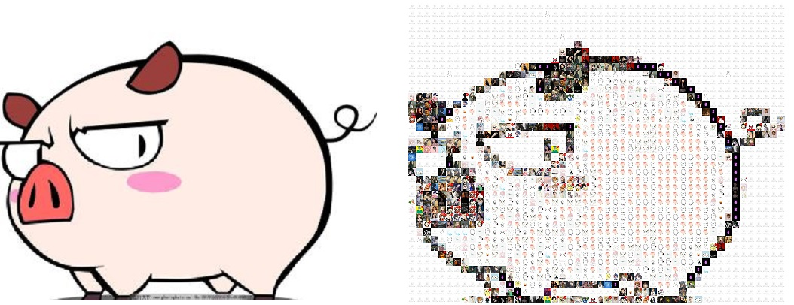
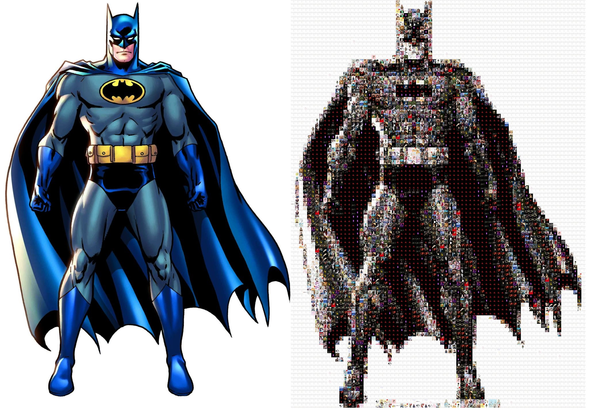

# PhotoMosaic
### 基本操作
1. 使用java的jsoup包简单的对网站图片进行爬取。
2. 将爬取到的图片进行灰度值计算。
3. 算出输入图片的每个block的RGB的灰度值。
4. 选出图片库中与之灰度值最接近的图片代替block。

### 基本思路
#### 概念
* 像素：像素即px，是画面中最小的点（单位色块）。像素的大小是没有固定长度值的，不同设备上1个单位像素色块的大小是不一样的。
* 分辨率：分辨率=画面水平方向的像素值 * 画面垂直方向的像素值。
* 灰度值：灰度就是没有色彩，灰度使用黑色调表示物体,即用黑色为基准色，不同的饱和度的黑色来显示图像。
彩色图象的灰度其实在转化为黑白图像后的像素值（是一种广义的提法），转化的方法看应用的领域而定，一般按加权的方法转换，R， G，B 的比一般为3：6：1。
#### RGB        
#### 算法
### 效果图
#### 小猪：

#### 蝙蝠侠：

### v1版问题

1. 需要原图分辨率在100*100左右，考虑到希望能看到每一块拼图，所以将每一块设置的比较大，
如果不必看到每一块拼图的效果，可以直接按像素进行拼接。1200\*1200的分辨率需要填补1200\*1200块图片，绘制时间和图片大小会非常大。
2. 图片爬取和图片绘制需要优化。
3. 算法不正确导致图片匹配存在不准确，颜色与原图差距较大。
4. 图片库图片多但是真正使用到的很少，灰色值相同的图片没有进行随机选取。

### v2版需改进
1. 算法准确度，即颜色匹配需要更大的改进！！
2. 算法性能
3. 处理图片分辨率。
