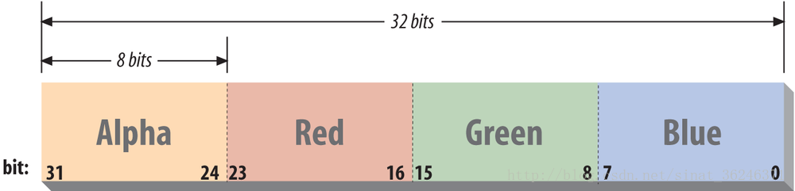
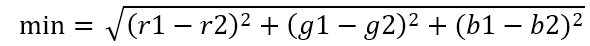

  

# PhotoMosaic
### 基本操作
1. 使用java的jsoup包简单的对网站图片进行爬取。
2. 获取每张图片的RGB。
3. 获取输入图片的每个block的RGB。
4. 选出图片库中与之最接近的图片代替block。

### 基本思路
#### 概念
* 像素：像素即px，是画面中最小的点（单位色块）。像素的大小是没有固定长度值的，不同设备上1个单位像素色块的大小是不一样的。
* 分辨率：分辨率=画面水平方向的像素值 * 画面垂直方向的像素值。
* 灰度值：灰度就是没有色彩，灰度使用黑色调表示物体,即用黑色为基准色，不同的饱和度的黑色来显示图像。
彩色图象的灰度其实在转化为黑白图像后的像素值（是一种广义的提法），转化的方法看应用的领域而定，一般按加权的方法转换，R， G，B 的比一般为3：6：1。
#### RGB        

如图所示，RGB使用32位来表示一个像素，RGB分量分别占8位，剩下的8位用作Alpha通道或者不用。该图是ARGB，可以看成带Alpha的RGB24
，所以在取得RGB后，如何获取red，green，blue三个值呢？那就是进行移位操作，例如要获取red分量的值，首先通过getRGB()方法获取到rgb的值，然后red = (rgb &0xff0000) >> 16，这样就获取到了red的值。
当然如果获取到r,g,b三个分量后要变回原来的结构即变回rgb，只要用( a<<24 ) | ( r<<16 ) | ( g<<8 ) | b
#### 算法
在计算图片库中与block块最匹配的过程中，我使用的算法：   
  
求出最小值。
### 效果图
#### 小猪：

#### 蝙蝠侠：

#### 蒙娜丽莎：

